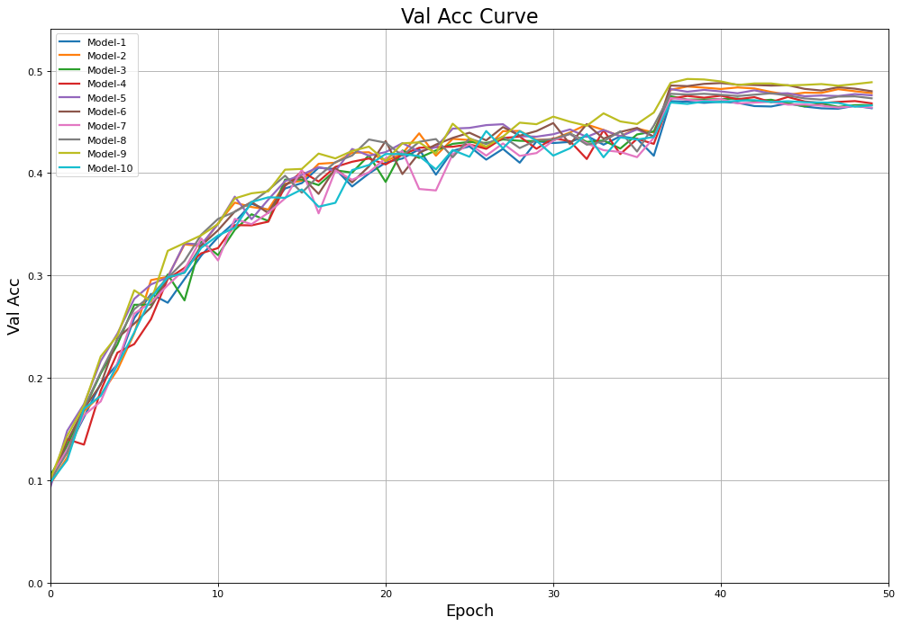
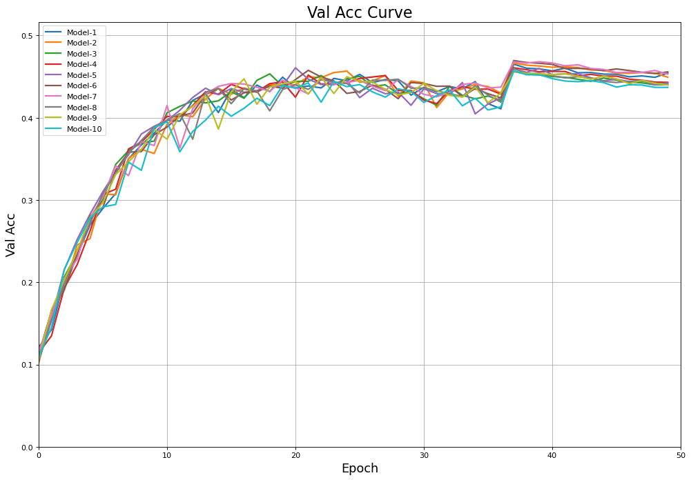

# MLDL2
Machine Learning & Deep Learning for Data Science 2

## Knowledge Distillation on CIFAR-100

This project implements Knowledge Distillation using the CIFAR-100 dataset, where a pretrained teacher model is used to guide the training of a smaller student model. Below is a summary of the process, results, and observations based on validation accuracy curves.

---

## Teacher Model
- **Architecture:** Pretrained ResNet-50
- **Dataset:** CIFAR-100
- **Purpose:** Provides softened outputs (logits) to train the student model effectively.
- **Pretrained Weights:** Loaded from a checkpoint (`pretrained_teacher.pth`).

---

## Student Model
- **Architecture:** A smaller variant of ResNet-18 with reduced layers.
- **Modifications:**
  - Removed the last block (`layer4`) for a more compact model.
  - Adjusted the fully connected layer for CIFAR-100 classification (100 classes).

---

## Training Process
1. **Dataset Preparation:**
   - Applied standard transformations including normalization, random cropping, and flipping.
2. **Loss Function:**
   - Used a custom distillation loss combining CrossEntropyLoss and KLDivergence.
   - Parameters:
     - Temperature (`T`): 4
     - Alpha: 0.5
3. **Optimizer:**
   - Stochastic Gradient Descent (SGD) with momentum (0.9) and weight decay (1e-4).
   - Learning rate: 0.1
4. **Training:**
   - Balanced supervised and distillation losses using the predefined `alpha` and `T`.
   - Dynamic learning rate adjustment was applied based on epochs.

---

## Results

### Why Validation Accuracy Curves?
While loss plots provide useful insights, the loss values for both ResNet-8 and ResNet-14 models were almost identical, making them less informative for comparison. Therefore, **validation accuracy curves** were used as they more effectively represent model performance across epochs, enabling a clearer distinction between the two models.

### Validation Accuracy Curves
- **ResNet-8 Student Model:**
  - The validation accuracy gradually improves, stabilizing around epoch 40.
  - See the accuracy curve below:
    

- **ResNet-14 Student Model:**
  - Exhibits a faster convergence and higher validation accuracy compared to ResNet-8.
  - See the accuracy curve below:
    

### Key Observations
1. Both ResNet-8 and ResNet-14 achieve stable validation accuracy by the end of training.
2. ResNet-14 consistently outperforms ResNet-8 in terms of validation accuracy.
3. Loss plots for both models were similar, leading to a focus on validation accuracy for comparison.

---

## Challenges
1. **Overfitting:**
   - Overfitting was addressed through label smoothing and regularization techniques.
2. **Computational Constraints:**
   - CUDA out-of-memory errors limited the size of the ResNet-18 ensemble.

---

## Key Takeaways
1. Knowledge distillation significantly improved the performance of student models compared to training independently.
2. ResNet-14 achieved higher validation accuracy due to its enhanced architecture while maintaining computational efficiency.
3. Validation accuracy curves highlighted the effectiveness of distillation even with smaller student models.

---

## Future Work
1. **Feature-based Knowledge Distillation:**
   - Evaluate the effectiveness compared to response-based methods.
2. **Loss Optimization:**
   - Experiment with different lambda values to balance losses.
3. **Efficient Ensembles:**
   - Investigate ways to maintain performance while reducing computational overhead.

---

## Conclusion
The project demonstrates the effectiveness of Knowledge Distillation on CIFAR-100, leveraging teacher-student architectures and validation accuracy curves to optimize training. The findings highlight the potential of distillation to enhance smaller models' performance while remaining computationally feasible.
